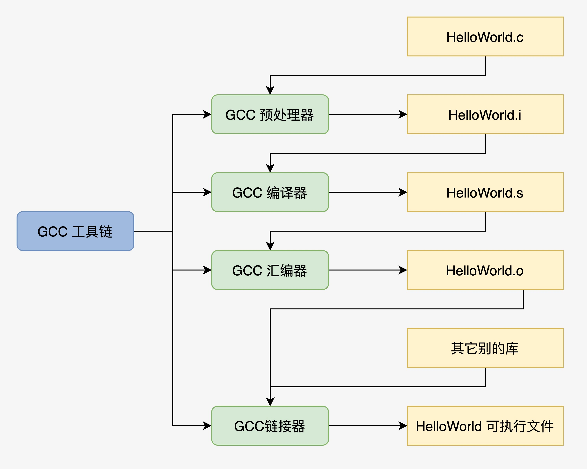
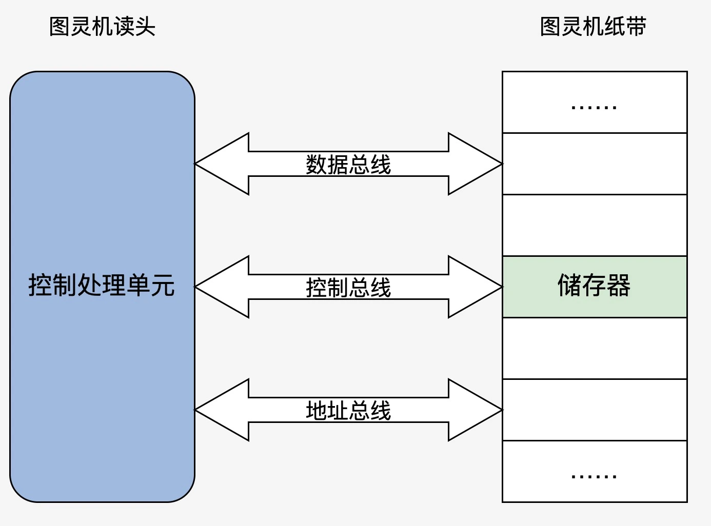

# 从机器到代码运行

现在很多程序都是使用高级语言比如C、C++、Java、Python等完成，
但是对于计算机硬件来说是没法直接运行这些文本文件的，比如下面这个最简单的C语言程序：

```c
#include <stdio.h>

int main(int argc, char** argv) 
{
    printf("Hello World\n");
    return 0;
}
```

我们需要先使用C语言编译器将这个文件编译成具体硬件平台对应的二进制代码，
再由操作系统创建进程将这个二进制文件装载到内存空间，才能让处理器执行这段代码。

## C程序编译过程

Linux平台下我们可以使用**GCC**来编译这段代码，处理流程如下：

1. 预处理（加入头文件，进行宏替换等操作）：
**`gcc -E main.c -o main.i`**
2. 生成汇编（将预处理过后的文件编译为汇编）：
**`gcc -S main.i -o main.s`**
3. 编译为可链接文件（将生成的汇编文件编译为可链接的文件，此时使用到的库还没有进行链接）：
**`gcc -c main.s -o main.o`**
4. 链接文件成可执行文件（将使用到的第三方库进行链接）：
**`gcc main.o -o main`**
5. 运行程序：**`./main`** 

上面流程如下图所示：



## 程序运行
编译完成后就可以装载运行了，说到计算机运行程序，自然少不了两大牛人：图灵和冯诺依曼。

图灵最先提出了一种理想计算机模型（图灵机）：**有一条无限长纸带，纸带上有无限个小格子，小格子内记录有相关信息，
纸带上有一个读头，读头可以读取小格子里面的数据并做出相应操作并且可以在纸带上来回移动。**

模型很好，但是只能是理想上的，现实很难实现，接着冯诺依曼就提出了使用二进制系统和电子元器件的计算机模型：
冯诺依曼计算机具有5大部件和功能：

1. **输入设备**：读取输入，即读取程序或数据
2. **存储设备**：可以将运算结果存储，下次还能使用。
3. **运算设备**：参与指令执行和运算。
4. **控制设备**：可以控制程序运行流程。
5. **输出设备**：可以将运算结果输出，方便人们查看。

对应到图灵机结构同下面差不多：



## 查看可执行文件

由于最终生成的二进制文件我们是没法看明白的，不过更高一层的汇编我们是可以查看的，
可以使用 `gcc -S main.c -o main.s` 查看gcc生成的汇编，也可以使用
`objdump -d main` 反汇编可执行文件。

