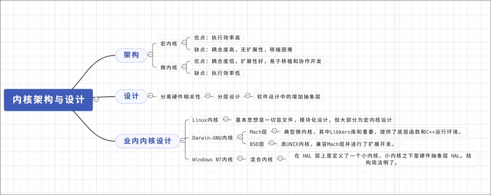

# 内核结构与设计

计算机有很多硬件和软件资源，而内核就是这些资源的管理者。

- 硬件资源

  1. 总线：负责连接各个设备，硬件协同工作的基础。
  2. CPU：中央处理器，负责执行程序和处理数据。
  3. 内存：存储运行时代码和数据。
  4. 硬盘：长期存储程序和用户数据。
  5. 网卡：与其他计算机进行通信。
  6. 显卡：负责显示和运算。
  7. IO设备：显示器、鼠标、键盘等外设。
  
- 内核管理资源
  1. **管理CPU**：将运行的程序抽象成进程，也称**进程管理**。
  2. **管理内存**： 程序和数据都需要占有内存，内核需要小心而高效的分配与释放内存
，也称**内存管理**。
  3. **管理硬盘**： 硬盘需要存放很多数据，内核将用户数据抽象成文件，也就成了管理文件，
合理的组织文件，方便用户查找，最后形成了不同的**文件系统**。
  4. **管理显示**：现在操作系统基本都需要支持GUI,内核中的**图像系统**就是用来管理显示的。
  5. **管理网卡**：不同计算机之间同系有各种不同复杂协议，以完成安全稳定的通信，在内核中
就形成了网络协议栈，也称**网络组件**。
  6. **管理IO设备**：内核中把键盘、鼠标等设备抽象成IO设备，也即**IO管理器**。

同时，很多硬件都有自己的操作方法，厂商将这些写成**驱动程序**，内核便可通过接口与硬件沟通，所以
**驱动程序**是硬件与内核沟通的桥梁。

## 内核结构

### 宏内核结构

听名字就知道，这种内核是很庞大的，也就是将上面这些管理功能统统纳入内核中，最后经过编译链接在一起，组成一个大的可执行程序。
这种内核是最早出现也是架构最简单的内核结构。

宏内核有明显的缺点，那就是**没有模块化，无扩展性，耦合度很高**，一旦某个组件出现问题，内核其他组件很可能一起崩溃。

当然它的优点也很明显，那就是性能很好，组件之间直接进行函数调用，节省大量时间。

### 微内核结构

微内核结构与宏内核刚好相反，提倡内核极度精简，仅提供核心的管理功能，实际的进程管理、设备管理、文件管理等都做成一个个系统服务进程，
服务之间通过消息交流。

对于工程来说，微内核有很多优点，比如**耦合度很低，扩展性高便于移植，可以很好的协作开发**。

缺点也很明显，服务之间通信通过消息，需要额外建立联系，还需要规定消息协议等，一次功能需要经过多次转发，性能下降。

商业级内核一般不会采用微内核而是混合内核，而微内核就非常适合进行教学用途。

## 内核设计

前面提过，不同硬件沟通方式不同，如果每适配一种内核就修改大量内核代码，那是不可能的，所以**分离硬件相关性**至关重要。

计算机领域的一个基本方法就是增加一个**抽象层**，从硬件层到操作系统层，再到应用程序层一层层构建。
分层的好处就是可以屏蔽底层细节，让上层开发更简单，使得两层之间独立发展。

分离硬件相关性，就是将操作硬件和处理硬件差异的代码抽离出来，形成一个独立的层，并对外提供相应接口，方便上层开发。

我们自己的内核如果分3层，那就是

- `内核硬件层`

    提供初始化、CPU控制、中断处理、物理内存管理、硬件其他操作。

- `内核功能层`

    完成内核核心功能如进程管理、内存管理、中断管理、设备管理、网络组件等。
    
- `内核接口层`
    
    定义一套 UNIX 子集的API接口，供应用程序使用。

思维盗图：

