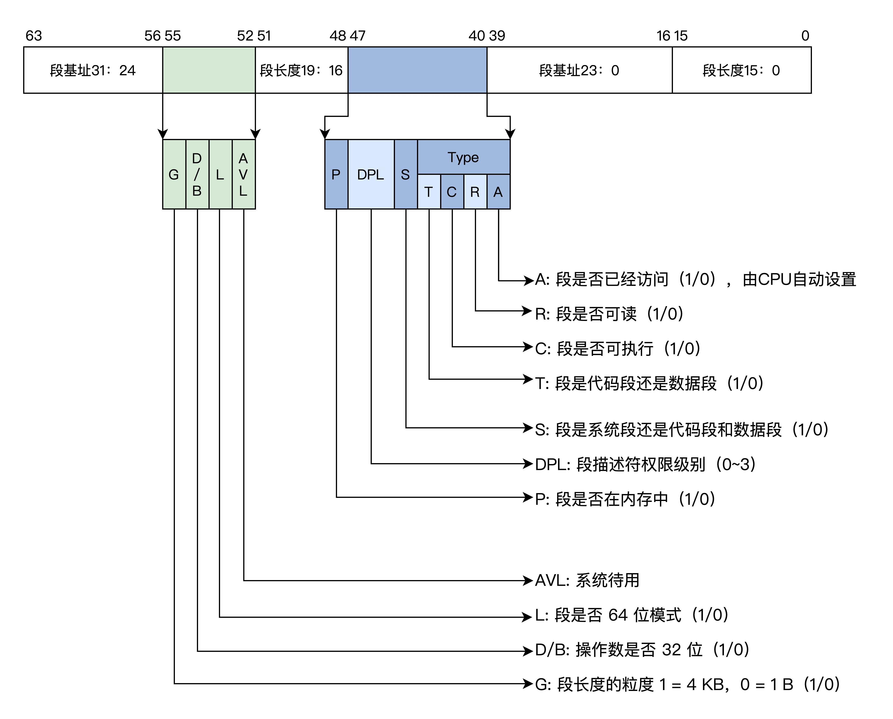
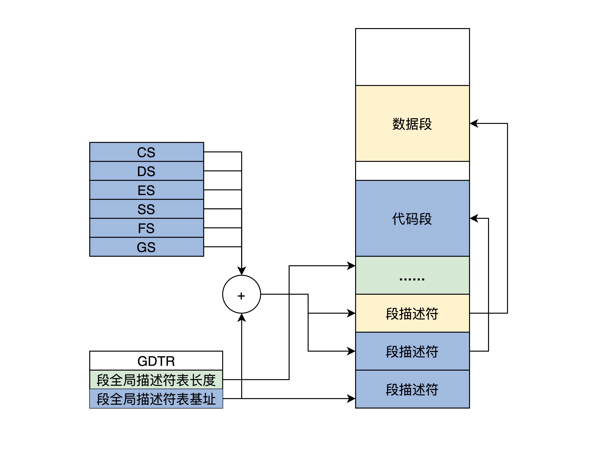
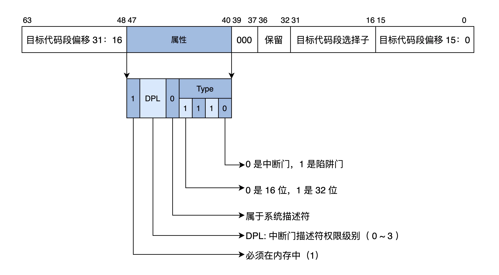
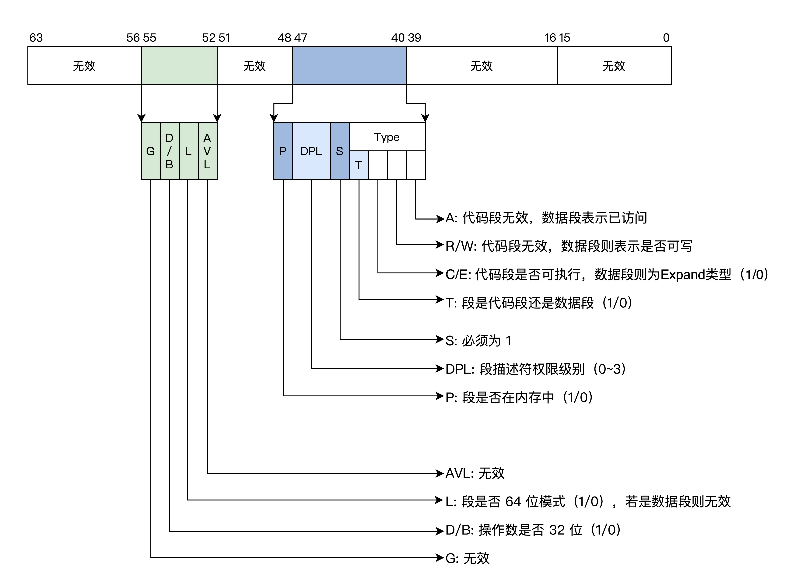
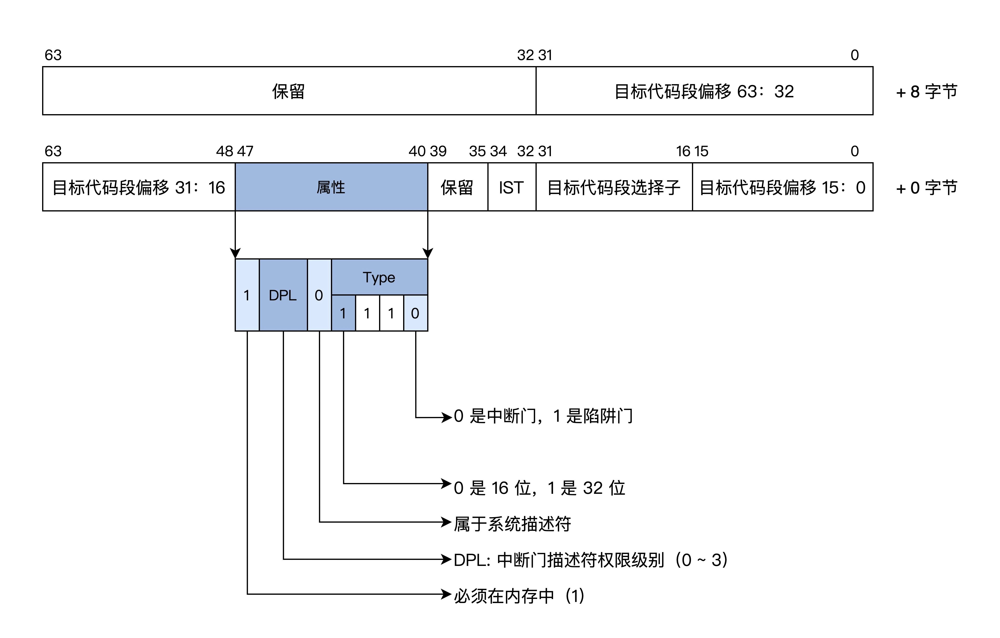

# CPU工作模式

常用电脑CPU都为X86平台，这里只记录X86平台CPU的三种工作模式。

## 实模式

实模式又称 **实地址模式** ，实即真实，指执行指令为真实指令（对指令不加限制，不作区分），指令访问内存为真实地址（对地址不加限制的访问）。

### 实模式寄存器

| 寄存器（每个寄存器均为16位） | 功能                                           |
| ---------------------------- | ---------------------------------------------- |
| AX、BX、CX、DX、DI、SI、BP   | 通用寄存器，可以存放地址、数据，参与运算       |
| IP                           | 程序指针寄存器，始终指向下一条指令的地址       |
| SP                           | 栈指针寄存器，始终指向当前栈顶，栈是向下增长的 |
| CS、DS、ES、SS               | 段寄存器，存放一个内存段的基址                 |
| FLAGS                        | CPU标志寄存器，存放CPU执行指令产生的状态位     |

### 实模式下访问内存

程序数据和指令都是存放在内存中的，CPU要执行需要先装载到寄存器中，然后再从寄存器中读取，而内存中的数据访问需要知道内存地址。

实模式下内存访问方式为：


其中 **代码段由`CS + IP`确定，而栈段由`SS + SP`确定 ** 。

上面的便是 **内存分段管理模型** ：内存地址由段寄存器左移4位，再加上一个通用寄存器值或常数组成地址值，再由这个地址去访问内存。16位寄存器便能访问20位地址了（16位左移4位为20位）。

### 实模式中断

中断即暂停执行当前程序，转而执行中断处理程序。实模式下中断会先保持当前 `CS + IP` 寄存器值，然后装载新的 `CS + IP` 寄存器值。

中断分为 **硬件中断** 和 **软件中断** 。

- 硬件中断

    中断控制器给CPU发送一个电子信号，CPU做出回应，然后中断控制器给CPU发送中断处理号。

- 软件中断

    CPU执行 `INT <中断号>`  指令。

无论软件还是硬件中断，都是CPU响应外部事件的一种方式。为实现中断，需要在内存中存放一个**中断向量表**，表地址和长度由CPU特定寄存器 `IDTR` 指向。实模式下表中每一个条目由**代码段地址和段内偏移**组成，CPU根据中断号，从`IDTR`计算出中断向量表条目，然后装载进寄存器，响应中断。

CPU响应中断可以理解为一个 `switch ... case ...` 函数，`switch` 匹配中断号，然后根据情况执行不同中断处理代码。

----

可以看到实模式下没有对指令进行限制，任何内存都可以访问，所以下面这段可怕的代码就可以执行了：

```c
int main()
{
    // 地址开始位置
    int* addr = (int*)0;
    cli(); // 关闭中断
    // 无限循环清空内存
    while(1) {
        *addr = 0;
        ++addr;
    }
    return 0;
}
```


## 保护模式

随着软件规模扩大，需要更高的计算量和内存，而内存一大，首先需要解决的就是**寻址**问题。16位寄存器最多能寻址 $2^{16} = 2^{16}Byte = 2^6 * 2^{10}Byte = 64KB$ 。寻址能力太低，CPU寄存器和运算单元都扩展为 32 位，便可寻址 $2^{32}Byte = 2^{22}KB = 2^2GB = 4GB$ （CPU寻址按字节寻址）。

### 保护模式寄存器

相比实模式，保护模式增加了一些控制寄存器和段寄存器，并扩展了通用寄存器位宽为 32 位，但可以单独使用32位的低16位，16位又可拆分为两个8位寄存器。

| 寄存器                            | 描述                                                         |
| --------------------------------- | ------------------------------------------------------------ |
| EAX、EBX、ECX、EDX、EDI、ESI、EBP | 32位通用寄存器，可存储数据和地址，参与运算                   |
| EIP                               | 32位程序指针寄存器                                           |
| ESP                               | 栈指针寄存器                                                 |
| CS、DS、ES、SS、FS、GS            | 16位段寄存器，存放一个内存段描述符索引（可能是历史原因导致其没有扩展至32位） |
| EFLAGS                            | 32位CPU标志寄存器，存放CPU执行指令运算产生的标志位           |
| CR0、CR1、CR2、CR3                | 32位CPU控制寄存器，控制CPU功能，比如开启保护模式             |

### 保护模式特权级

保护模式提供了对CPU执行指令的保护（限制），为区分不同指令，CPU实现了 4 种特权级，从 `R0~R3` 指令权限逐步降低，其中 `R0` 可以执行所有指令，之后特权级只能执行前一级别指令数量的子集。内存访问需要**段描述符和特权级配合** 。

### 保护模式段描述符

保护模式仍然采用**分段内存模型**，但是提供了对内存访问的保护。

32位CPU段基址和段内偏移都扩展为了32位，16位的段寄存器肯定放不下，所以就需要将一个内存段的信息封装成特定格式的**段描述符**，放到内存中，格式如下：



多个段描述符在内存中形成**全局段描述符表**，该表基地址和长度由CPU的 `GDTR` 表示。



此时段寄存器不再存放内存段基址，而是具体内存段的段描述符索引，访问内存时，根据段寄存器中索引和 `GDTR` 寄存器值找到内存中的段描述符，然后根据其中位信息判断能否访问。

### 保护模式段选择子

上面提到的段寄存器其实不只是存储段描述符索引，而是由 **影子寄存器、段描述符索引、描述符表索引、访问权限级别**组成，结构如下：


其中16以上到第80位共64位为影子寄存器，这是由硬件自动操作，对程序员不可见的部分，低16位刚好由16位的段寄存器存储。影子寄存器是arm处理器引入的一个高速缓存，用来减少性能损耗。

段描述符为8字节对齐，所以索引都是8的整数倍，比如 `8 = 1000` 、`16 = 10000` 、`24 = 11000` ，低三位都是0，可以用做 `RPL` 和 `TI` 。通常，`CS`和`SS`中的RPL（Request Privilege Level）就组成了CPL（当前权限级别 Current Privilege Level），表示访问者通过什么权限去访问目标段，当CPL大于目标内存段的DPL（Descriptor Privilege Level）时CPU禁止访问。

32位寄存器最多表示 4GB 大小地址，所以一个段的长度也最多为 4GB ，将段基址设置为 0 ，长度设置为 $0xFFFFF = 2^{20}$ ，段的粒度设置为 `4KB` ，此时段的最大长度为：$2^{20} * 4KB = 4GB$，这样所有段都指向同样大小字节的地址空间。

### 保护模式中断

实模式下不需要进行权限检查，所以可以直接装载中断向量表项值到 `CS:IP` 中执行中断程序，但是保护模式下需要进行**权限检查**，还有**特权级切换**，需要扩展中断向量表信息，每个中断信息用一个**中断门描述符**表示，简称**中断门**，格式如下：



保护模式内存中也必须有一个中断向量表，由 `IDTR` 指向。与实模式不同，表项变成了中断门描述符。

中断过程：

1. 产生中断并发送中断号，CPU判断中断号，检查其类型，是否为系统描述符，是否在内存中等。
2. 检查中断门中段选择子指向的段描述符。
3. 权限检查，如果CPL小于等于中断门DPL （有权限执行中断），且CPL大于等于中断门段选择子指向的段描述符的DPL（权限不足以访问内存段），就指向段描述符DPL（提升CPL）。如果CPL等于段描述符的DPL,则为同级权限不需要进行栈切换，否则需要进行栈切换，还需要从 `TSS` 加载具体权限的 `SS、ESP`，同时也许要对 `SS` 栈中段选择子指向的段描述符权限进行检查。
4. 权限检查完毕后会加载中断门描述符中段选择子到 `CS` 寄存器，目标代码段偏移加载到 `EIP` 寄存器中。

### 切换到保护模式

x86 CPU 在第一次加电和每次 `reset` 后都会自动进入实模式，需要进入保护模式，就需要我们自己写代码切换到保护模式，步骤如下：

1. 准备全局段描述符表

    ```asm
    GDT_START:
    knull_dsc: dq 0
    ; 第一个段描述符基址必须为0
    kcode_dsc: dq 0x00cf9e000000ffff
    ; 代码段
    ;段基地址=0，段长度=0xfffff
    ;G=1,D/B=1,L=0,AVL=0 
    ;P=1,DPL=0,S=1
    ;T=1,C=1,R=1,A=0
    kdata_dsc: dq 0x00cf92000000ffff
    ; 数据段
    ;段基地址=0，段长度=0xfffff
    ;G=1,D/B=1,L=0,AVL=0 
    ;P=1,DPL=0,S=1
    ;T=0,C=0,R=1,A=0
    GDT_END:
    
    GDT_PTR:
    GDTLEN dw GDT_END-GDT_START-1
    GDTBASE dd GDT_START
    ```

2.  设置 `GDTR` 寄存器，指向全局段描述符表

    ```asm
    lgdt [GDT_PTR]
    ```

3. 设置 `CR0` 寄存器，开启保护模式

    ```asm
    ; 开启PE
    mov eax, cr0
    ; CR0.PE = 1
    ; bts指令的意思是bit test and set 位测试并设置 
    ; 在此处的作用是判断eax与0，若eax == 0：bts会将CF = 1，并将eax置位（置位的意思就是设置为1） 
    ; 然后把CR0的最低位设为1之后，就表示开启了保护模式
    bts eax, 0
    mov cr0, eax
    ```

4. 长跳转，加载CS寄存器，开始运行

    ```asm
    ; 刚进入保护模式下，段寄存器中值还是实模式下的
    ; 需要长跳转来清空指令流水线，重新加载CPU信息
    jmp dword 0x8 : _32bits_mode ; _32bits_mode 表示32位段偏移
    ; 0x8就翻译成： INDEX TI CPL  
    ; 0x8 =         1     00 0 
    ; INDEX代表GDT中的索引，TI为0代表使用GDTR中的GDT，CPL代表处于特权级
    ; 即GDT表中的第1个（index从0开始）描述符。 _32bits_mode作为段内偏移，然后得
    ; GDT第一个1段描述符 + _32bits_mode的内存地址 = 段基址 + 段内偏移地址
    ```

5. CPU发现CR0寄存器0位值为1,按照GDTR寄存器指示找到全局段描述符表，将新的段描述符信息加载到`CS` 寄存器，CPU正式进入保护模式，具有32位处理能力。

## 长模式

长模式又名 **AMD64** ，最早由AMD公司定义，使CPU在现有基础上有了64位处理能力，既能完成64位运算，也能完成64位寻址。

### 长模式寄存器

长模式相比保护模式，又增加了一些通用寄存器，并扩展位宽为64位，同时可以单独使用低32位，低32位可以拆分成低16位，16位又可拆分成两个8位寄存器。

| 寄存器                                     | 描述                                         |
| ------------------------------------------ | -------------------------------------------- |
| RAX、RBX、RCX、RDX、RDI、RSI、RBP、R8～R15 | 64位通用寄存器，可以存放数据、地址，参与运算 |
| RIP                                        | 64位程序指针寄存器                           |
| RSP                                        | 64位栈指针寄存器                             |
| CS、DS、ES、SS、FS、GS                     | 还是16位寄存器，存放内存段描述符索引         |
| RFLAGS                                     | 64位CPU标志寄存器                            |
| CR0～CR4                                   | 除了CR0还是32位，其他几个都为64位            |

### 长模式段描述符

长模式仍然具备保护模式大部分相同功能，段描述符结构发生了改变，其中段基址和段长度无效：



长模式下，CPU不再对段基址和段长度进行检查，只对DPL进行检查，流程跟保护模式一样。

### 长模式中断

保护模式中中断门描述符其中段内偏移只有32位，但是长模式支持64位内存寻址，所以对中断门进行了修改和扩展。



其中目标代码段选择子对应段描述符必须为64位代码，且IST是64位TSS中的IST指针。长模式下仍然有一个中断向量表，表条目为16字节，最多支持256个中断源，对中断响应和权限检查跟保护模式相同。

### 切换到长模式

可以直接从实模式模式切换到长模式，也可以从保护模式切换到长模式。步骤如下：

1. 初始化全局段描述符表

    ```asm
    ex64_GDT:
    null_dsc: dq 0 ; 第一个段描述符必须为0
    c64_dsc: dq 0x0020980000000000
    ; 代码段
    ;无效位填0
    ;D/B=0,L=1,AVL=0 
    ;P=1,DPL=0,S=1
    ;T=1,C=0,R=0,A=0
    d64_dsc: dq 0x0000920000000000
    ; 数据段
    ;无效位填0
    ;P=1,DPL=0,S=1
    ;T=0,C/E=0,R/W=1,A=0
    eGdtLen equ $ - null_dsc; equ伪指令，定义段长度为当前地址减去 null_dsc，共24字节
    eGdtPtr: dw eGdtLen - 1 
    	dq ex64_GDT
    ```

2. 使用分页模式，初始化MMU页表，长模式下必须开启分页模式，否则内存地址空间就的不到保护了（不对段描述符的基址和偏移进行检查了）。MMU依赖页表对地址的转换，页表有特定格式，其地址由 `CR3` 寄存器指出。

    ```asm
    mov eax, cr4
    bts eax 5 ; CR4.PAE = 1
    mov cr4, eax ; 开启分页模式
    mov eax, PAGE_TABLE_BASE_ADRESS ; 页表物理开始地址
    mov cr3, eax ; 知道MMU页表位置
    ```

3. 加载 `GDTR` 寄存器，指向全局段描述符表。

    ```asm
    lgdt [eGdtPtr]
    ```

4. 开启长模式，同时开启保护模式和分页。长模式中定义了 `MSR` 寄存器，需要专门的指令 `rdmsr、wrmsr` 进行读写，`IA32_EFER` 寄存器地址为 `0xC0000080` ，它的第8位决定是否开启长模式。

    ```asm
    ; 开启长模式
    mov ecx, IA32_EFER
    rdmsr
    bts eax, 8 ; IA32_EFER.LME=1
    wrmsr
    ; 开启保护模式和分页
    mov eax, cr0
    bts eax, 0; CR0.RE=1
    bts eax, 31
    mov cr0, eax
    ```

5. 长跳转，刷新 `CS段寄存器` 。

    ```asm
    jmp 08: entry64 ; entry64是64位段内偏移地址
    ```

----

## 总结

思维导图：


