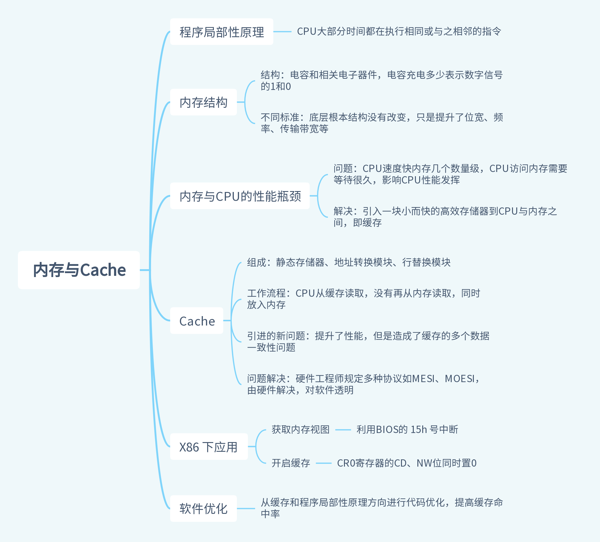

# 缓存

## 程序局部性原理

通常情况下，我们编写的代码多为顺序和循环结构，循环中，CPU大多时候都在执行同一条命令，程序一旦编译完成装载进内存执行，地址就确认了，也就是说CPU大部分时间都在执行相同或相邻的指令。

而**程序局部性原理**就是：**CPU多数时间都在执行相同指令或与之相邻的指令**。

## 内存到CPU的性能瓶颈

内存，又叫 `DRAM` ，即动态随机存储器。内存存储颗粒芯片中的存储单元是用电容和相关元件做成，电荷存储多少代表数字信号的 1 和 0 。随着内存技术的进步，性能不断提升，不过内部存储颗粒结构没有本质改变，只是提升了位宽、频率、传输时预存数据位数等。

最新的DDR4、DDR5内存传输带宽也不过几十上百G/s，与CPU的传输带宽差了几个数量级。CPU这么快，是因为CPU使用了更精细的技艺，更高级的材料，如果内存也使用CPU一样的工艺和材料，那价格估计没几个人买得起。

CPU需要读取内存数据，读取数据需要时间，读取时CPU通常会插入等待时钟周期，等待内存数据准备好，这个时间足够CPU运行很多指令了，加上多个CPU同时访问内存，内存总线争用问题，进一步拉大了内存与CPU的性能差。

所以不管CPU多么快，只要内存跟不上，你就没法发挥CPU的全部性能。

## 缓存

根据前面的**程序局部性原理**，CPU大部分时间都在访问同一地址或与之相邻的地址。那就可以使用一块**小但快**的存储器，将其放在CPU与内存之间，每次读取一块内存放入这个快的存储器中，CPU需要时直接读取这个小而快的存储器，这就有效缓解了CPU与内存之间的性能瓶颈。而这小而快的存储器便是 **高速缓存** 。

缓存中存放经常访问的数据，CPU访问时先访问缓存，没有再从内存读取，同时将读取的数据放进缓存，缓存有大小，会根据一些算法进行新旧数据处理。这样，CPU总能在大多数时候从缓存中读取到想要的数据。

缓存可以集成到CPU内部，也可以做出单独芯片放到总线上，X86 CPU和 ARM CPU中都集成了缓存（离得越近，越容易沟通，现代CPU已经有多级缓存了）。

### Cache结构

缓存主要由高速 **静态存储器、地址转换模块、Cache行替换模块** 组成。Cache会将高速存储器和内存分成相同的行，一行通常为 32 字节或 64 字节，类似二维数组。Cache与内存交换数据的最新单元是一行，为方便管理，Cache中多个行又会形成一组。

### Cahce工作流程

Cache工作的大致逻辑流程为：

1. CPU发出请求地址，由Cache地址转换模块转换为 **组号、行号、行内偏移** 三段地址。
2. Cache会根据地址信息找到对应行，如果命中则通过行内偏移读取并返回给CPU，未命中就分配一个新行并访问内存，将内存数据加载到Cache行并返回数据给CPU。写入分为 **回写和直通写** ，回写是写入Cache行就完成，直通写在写入Cache的同时写入内存。
3. 如果Chache没有新行了，就要进行旧行数据的替换，即找到一个不用的行写回内存腾出一些空间供其他数据使用。为降低替换代价，会使用替换算法，常见的有 **最近最少使用（LRU）、先进先出（FIFO）、随机算法（RAND）** 。

Cache工作逻辑由硬件实现，对软件透明。

## 缓存带来的问题

Cache虽然提升了性能，但是带来了一个新的问题：**数据一致性** 。

现代CPU多为多核心结构，每个核心都有自己的缓存，也有所有CPU共享的缓存，比如下面这个结构：


此时多核心CPU缓存带来的缓存一致性就包含以下方面：

- 单个核心内部指令Cache与数据Cache的数据一致性问题。
- 不同核心CPU之间的二极缓存数据一致性问题。
- 三级Cache与设备内存、显存等之间的数据一致性问题。

为解决上面这些缓存带来的问题，硬件工程师开发了多种协议，典型的多核心缓存数据同步协议有 `MESI` 和 `MOESI` 。

## X86 CPU开启Cache

X86 CPU默认是关闭缓存的，需要在CPU初始化时开启Cache。

X86上开启Cache很简单，只需要将 `CR0` 寄存器中 `CD、NW` 位同时清 0 即可。`CD=1`时表示关闭Cache，`NW=1` 时表示不维护数据一致性，所以开启缓存应该同时将 `CD、NW` 位清 0 。

```asm
mov eax, cr0
; 开启Cache
; btr 寄存器 位数 -> 将寄存器指定位数置为0
; bts 寄存器 位数 -> 将寄存器指定位数置为1
btr eax, 29 ;CR0.NW=0
btr eax, 30 ;CR0.CD=0
mov cr0, eax
```

## 获取内存视图

作为系统软件开发员，更因该了解系统内存有多大，那些内存可写。给出一个物理地址并不能准确定位到内存空间，内存空间只是物理地址空间映射出的一个子集，很多硬件都有自己的内存，也不是连续分布的，更重要的是获取到哪些物理内存是系统软件可以读写的内存。

X86 下的BIOS 提供了便捷的中断服务来获取内存信息，计算机加电后BIOS会执行硬件初始化，设置中断向量表，所以BIOS的中断服务便是执行中断，中断号为 `15h` 。执行前需要进行一些特殊寄存器设置：

```asm
; 获取内存视图
_getmemmap:
  xor ebx, ebx ;ebx设为0，异或运算相同为0
  mov edi, E80MAP_ADR ;edi设为存放输出结果的1MB内的物理内存地址
loop:
  mov eax, 0e820h ;eax必须为0e820h
  mov ecx, 20 ;输出结果数据项的大小为20字节：8字节内存基地址，8字节内存长度，4字节内存类型
  mov edx, 0534d4150h ;edx必须为0534d4150h
  int 15h ;执行中断
  jc error ;如果flags寄存器的C位置1，则表示出错
  add edi, 20;更新下一次输出结果的地址
  cmp ebx, 0 ;如ebx为0，则表示循环迭代结束
  jne loop  ;还有结果项，继续迭代
  ret
error: 
; . . .
;出错处理
```

每次中断都会输出一个20字节大小的数据项，最后组成一个该数据项的数组，可以用C语言结构体表示。

## 总结

Cache硬件提升了性能，且在硬件层屏蔽了细节，不需要软件担心。但是硬件处理也是有代价的，如果软件编程时不能规避某些问题，就可能导致Cache难以命中或其他问题，让硬件去维护大量缓存数据问题，造成程序性能的下降。

对于软件开发来说，更好的利用缓存特性，编写Cache命中率高的代码有助于提升软件性能，常见的方案方有：

- 遵从80-20法则，程序80%时间都在运行20%代码，针对频繁访问的代码进行优化，才容易产生优化效果。
- 遵从数据访问局部性，按数据存放顺序访问代码比乱序访问效率高，更好的贴合Cache行，优化数据结构，进行数据压缩或填充。
- 遵从指令访问局部性，减少跳转指令，帮助CPU做好Cache的预测工作。
- 避免计算线程在多个核心间跳动，可以绑定核心，避免缓存的重复加载和同步，提升效率。
- 多核环境下，减少多个核心对同一内存区域的内存并发操作，减少内存失效情况发生。
- 合理提升进程优先级，避免进程间切换，变相提高Cache。
- 关闭Swap，变相提升内存、缓存效率。
- ……

思维导图：



