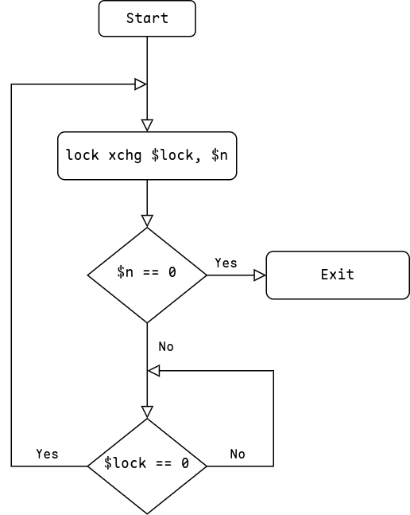

# 解决并发操作数据竞争的几种方法

## 问题引入

先来看一段看似没错的C++语言代码：

```c++
int g_a = 0;

// 这里模拟中断处理代码
void interrupt_handle() {
    g_a++;
}
// 这里模拟在一个线程中运行的函数
void thread_func() {
    g_a++;
}
```

`g_a++` 这行代码翻译成汇编可能为几条指令：

```asm
mov eax, [g_a] ; 移动g_a到eax寄存器
add eax, 1     ; 将eax中值加一
mov [g_a], eax ; 移动寄存器值到g_a变量
```

如果 `thread_func` 函数执行 `g_a++` 到第二行汇编指令时中断来袭，开始运行中断处理函数，中断处理完成后再返回来执行第三条汇编指令，则 `g_a` 的值可能并不是我们期望的结果！

| 时间 | interrupt_handle | thread_func      | g_a的值 |
| ---- | ---------------- | ---------------- | ------- |
| 1    |                  | `mov eax, [g_a]` | 0       |
| 2    |                  | `add eax, 1`     | 0       |
| 3    | `mov eax, [g_a]` |                  | 0       |
| 4    | `add eax, 1`     |                  | 0       |
| 5    | `mov [g_a], eax` |                  | 1       |
| 6    |                  | `mov [g_a], eax` | 1       |

可以看到，我们预期的 `g_a` 值应该为 2 ，但实际为 1 ，这便是一个数据同步问题。

>  上面代码出现问题，有两个原因，一个是 `g_a++` 对应多条指令，如果将 `g_a++` 多条指令合并为一条不可分割的指令，即 **原子操作** ，可以避免，另一个便是执行 `g_a++` 指令期间 **关闭中断** ，确保多条指令执行完成。

## 原子操作 -- 操作简单变量

靠编译器自动实现原子操作不太可能，一是编译器不知道哪个变量需要原子操作，再者编译器也不能保证原子操作在每个平台都可用。

X86平台支持很多原子指令，常见的如 `原子读、原子写、原子加、原子减` 等，使用汇编语言调用对应的指令即可。

为了方便在之后C语言或C++语言中使用，可以使用通过嵌入汇编实现，比如封装一个简单的原子变量：

```cpp
// 定义32位int的原子量
struct atomic_i32 {
private:
    // i32_t表示有符号32位int类型, alignas要求按指定字节对齐
    static constexpr int32_t _kAlignment = alignof(int32_t);
    alignas(_kAlignment) volatile int32_t _atomic_count = 0;
    
public:
    atomic_i32() noexcept = default;
    ~atomic_i32() noexcept = default;
    atomic_i32(const atomic_i32*) = delete;
    atomic_i32& operator = (const atomic_i32&) = delete;
    atomic_i32& operator = (const atomic_i32&) volatile = delete;

    constexpr atomic_i32(int32_t v) noexcept : _atomic_count(v) {}

    operator int32_t() const noexcept
    { return load(); }
    // ...
    
public:
    // 原子读取值
    volatile i32_t load() const {
        i32_t n;
        __asm__ __volatile__(
                "mov %1, %0\n\t"
                : "=r"(n)
                : "m"(this->_atomic_count)
                : "memory"
                );
        return n;
    }
    // 原子写
    void store(i32_t value) {
        __asm__ __volatile__(
                "mov %1, %0\n\t"
                : "=m"(this->_atomic_count)
                : "r"(value)
                : "memory"
                );
    }
    // 原子加
    i32_t add(i32_t value) {
        i32_t old;
        __asm__ __volatile__(
                "lock addl %0, %1\n\t"
                : "=r"(old), "+m"(this->_atomic_count)
                : "0"(value)
                );
        return old;
    }
    // 原子减
    i32_t sub(i32_t value) {
        i32_t old;
        __asm__ __volatile__(
                "lock subl %0, %1\n\t"
                : "=r"(old), "+m"(this->_atomic_count)
                : "0"(value)
                );
        return old;
    }
    // 原子加一
    void inc() {
        __asm__ __volatile__(
                "lock incl %0\n\t"
                : "+m"(this->_atomic_count)
                );
    }
    // 原子减一
    void dec() {
         __asm__ __volatile__(
                "lock decl %0\n\t"
                : "+m"(this->_atomic_count)
                );
    }
    
}; // atomic_i32
```

要在C++中实现原子操作，需要内联汇编，并使用一些 X86 平台下的原子指令，其中 `lock` 前缀可以

AT&T汇编语法 32 位加减操作符后缀为 `l` ，加上 `lock` 前缀表示这是一个原子操作，`lock` 可以锁住缓存或总线，而嵌入汇编的 `memory` 修饰可以保证操作正确的内存顺序。

关于C++内联汇编可以参考：

- [IBM C++ Inline asm](https://www.ibm.com/docs/en/xl-c-and-cpp-aix/16.1?topic=compatibility-inline-assembly-statements) 
- [GCC Inline asm](https://www.ibiblio.org/gferg/ldp/GCC-Inline-Assembly-HOWTO.html) 
- [Intel C++ Inline asm](https://www.intel.com/content/www/us/en/docs/cpp-compiler/developer-guide-reference/2021-8/inline-assembly.html) 
- [Visual Studio C++ Inline asm](https://learn.microsoft.com/en-us/cpp/assembler/inline/inline-assembler?view=msvc-170) 

有了原子量后，上面问题代码就可以修改为：

```cpp
atomic_i32 g_a{};

// 这里模拟中断处理代码
void interrupt_handle() {
    g_a.inc();
}
// 这里模拟在一个线程中运行的函数
void thread_func() {
    g_a.inc();
}
```

## 控制中断 -- 操作复杂变量

中断是CPU响应外部事件的重要机制，但是在进行中断处理时应该避免其他中断程序也操作同一处数据，即互斥的。原子操作适用于简单变量的基本算术操作，而不适用于多行代码的互斥，中断处理通常不止一两行，且 X86 汇编本身只支持一些简单原子操作。所以对于互斥，应该从其他地方入手，比如中断本身。

可以在执行一段指令时关闭CPU中断，执行完成后再关闭中断，这样在执行代码时不会响应其他中断事件，自然不存在多个中断程序同时运行了。X86 下开启、关闭中断指令分别为：`sti` 和 `cli` 。它们主要是设置 CPU eflags 寄存器的 `IF` 位，只能在 `Ring0` 权限下执行。

也可以通过嵌入汇编来完成：

```c++
// 开启中断响应
static inline void cpu_sti()
{
    __asm__ __volatile__(
            "sti\n\t"
            :
            :
            : "memory"
            );
}
// 关闭中断响应
static inline void cpu_cli()
{
    __asm__ __volatile__(
            "cli\n\t"
            :
            :
            : "memory"
            );
}
```

如果只是这样实现，那么存在一个严重问题：嵌套使用会失效！比如：

```cpp
int g_a {0};

void add_ga() {
    cpu_cli(); // 关中断
    ++g_a;
    cpu_sti(); // 开中断
}

void interrupt_handle()
{
    cpu_cli(); // 关中断
    add_ga(); // 此步之后CPU已经开启中断
    // ...
    // 此时中断关闭失效
    cpu_sti(); // 开中断
}
```

如何解决呢？关闭中断时可以先将 `eflags` 寄存器内容保存到当前栈顶，关闭中断，之后再将栈顶元素弹出到一个变量中保存 `eflags` 状态。开启中断时将之前保存的 `eflags` 状态恢复到 `eflags`寄存器中。

```cpp
typedef u64_t cpuflags_t;

// 开启中断
static inline void cpu_sti(const cpuflags_t* flags)
{
    __asm__ __volatile__(
            "pushq %0\n\t" // 保存指定的 eflags 标志到栈顶
            "popfq\n\t"     // 弹出标志到 eflags 寄存器
            :
            : "m"(*flags)
            : "memory"
            );
}

// 关闭中断
static inline void cpu_cli(cpuflags_t* flags)
{
    __asm__ __volatile__(
            "pushfq\n\t"    // 保存 eflags 寄存器内容到栈顶
            "cli\n\t"       // 关闭中断
            "popq %0\n\t"  // 弹出栈顶元素到标志变量
            : "=m"(*flags)
            :
            : "memory"
            );
}
```

 这样处理后，即使嵌套使用，如果之前已经关闭中断，那么嵌套时使用 `cpu_sti` 时传递 `flags` 标志给 `eflags` 寄存器还是关闭中断状态，不会影响之后的代码（前提是开启中断时传递的 `flags` 变量是关闭中断时传递的 `flags` 变量）。

## 自旋锁 -- 协调多核CPU

前面关闭、开启中断的方法能生效是因为以前为单核心CPU，只有一条代码执行流，关闭中断后没有其他代码执行流。但是时代变了，现在CPU几乎都是多核心，单个CPU核心关闭中断，之后关闭当前核心的代码，不会影响其他核心的代码，其他核心代码还是可能操作到同一个区域数据。

此时需要使用新的解决方案，那就是 **自旋锁** 。自旋锁的原理是：**首先读取锁变量，判断是否加锁，如果没有加锁则进行加锁之后返回，如果已经加锁，则回到第一步读取锁变量并继续判断是否加锁，直到没有加锁，进行加锁后返回** 。

要保证这个算法能正确，就必须确保 **读取锁变量判断是否加锁并解锁的步骤是原子的** 。否则 CPU0 判断没有加锁时还没来得及加锁，CPU1也判断没有加锁，然后两个核心都进行加锁，出现问题。

对于判断是否加锁和进行加锁，X86 下可以使用 **`xchg`** 指令完成，`xchg` 能将寄存器中某个值与内存中某个值进行交换，我们规定锁变量为 0 时是未锁定状态，为 1 时是锁定状态，用 1 去与锁变量交换，如果锁变量未锁定，则交换后锁变量变为锁定，交换出的值是 0 ，如果锁变量已经锁定，交换后锁变量仍然是锁定状态，但是交换出来的值是 1 ，表示之前锁变量是锁定的，此时应该 “自旋” ，直到交换出来的值为 0  时退出。

流程如下：



这样实现后虽然能正常工作，但是如果自旋锁中获取了锁，但是中途发生中断，中断处理程序还是使用同一个全局自旋锁，则中断处理程序获取锁，会导致死锁（中断中永远无法获取到锁，一直自旋！）。所以还需要在实现的基础上加上中断控制代码！代码实现如下：

```cpp
// ...
typedef u64_t cpuflags_t;
// 自旋锁
struct SpinLock
{
public:
    SpinLock() noexcept = default;
    ~SpinLock() noexcept = default;

    SpinLock(const SpinLock&) noexcept = delete;
    SpinLock& operator = (const SpinLock&) noexcept = delete;

public:
    // 加锁
    void lock(cpuflags_t* flags)
    {
        __asm__ __volatile__(
                "pushfq\n\t"            // eflags 寄存器内容入栈
                "cli\n\t"               // 关闭中断
                "popq %1\n\t"           // 保存到 eflags

                "1:\n\t"                // ===== 1 =====
                "lock xchg %0, %2\n\t"  // 交换 1 与 $lock
                "cmpl $0, %2\n\t"       // 判断交换出来的值
                "jnz 2f\n\t"            // 如果不为1,说明已经加锁，跳转到 2
                "jmp 3f\n\t"            // 如果为0,说明没有加锁，跳转到 3 退出

                "2:\n\t"                // ===== 2 =====
                "cmpl $0, %0\n\t"       // 判断 $lock 与 0
                "jnz 2b\n\t"            // 如果不相等说明锁没有释放，跳转到 2 继续执行
                "jmp 1b\n\t"            // 相等说明锁已经释放，跳转到 1 执行

                "3:\n\t"                // ===== 3 =====
                : "=m"(this->_lock), "=m"(*flags)
                : "r"(1)
                : "memory"
                );
    }
    // 解锁
    void unlock(cpuflags_t* flags)
    {
        __asm__ __volatile__(
                "movl $0, %0\n\t"   // 解锁将自旋锁变量置为 0 即可
                "pushq %1\n\t"
                "popfq\n\t"
                : "=m"(this->_lock)
                : "m"(*flags)
                : "memory"
                );
    }

private:
    volatile u32_t _lock = 0;

}; // SpinLock
```

## 信号量

